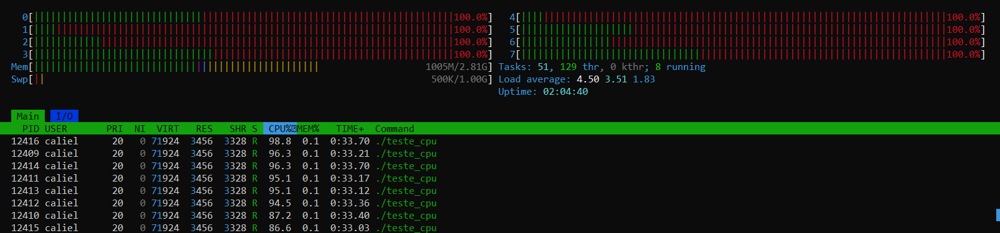
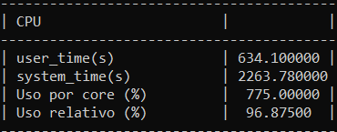
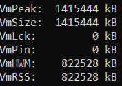
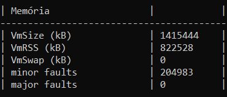
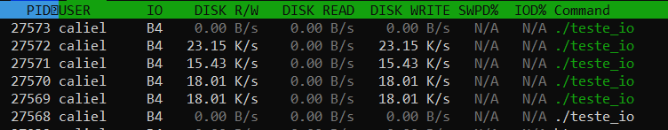
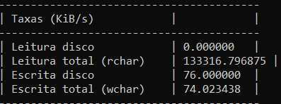

# grupo7_RA3
Esta atividade propõe o desenvolvimento de um sistema de profiling e análise que permita monitorar, limitar e analisar o uso de recursos por processos e containers, explorando as primitivas do kernel Linux que tornam a containerização possível.

## Metodologia de Testes
## Responsável - Caliel Carvalho de Medeiros

### Teste de CPU

O teste de CPU verifica a precisão das medições de utilização de processamento. O programa executado realiza operações matemáticas contínuas utilizando um número conhecido de threads, cada uma ocupando aproximadamente um núcleo lógico. O profiler monitora o PID do processo enquanto o htop fornece valores de referência. A validação consiste em comparar o uso esperado com o uso reportado pelo kernel e o uso medido pelo profiler.

### Htop monitorando os cores do cpu

### Resource profiler monitorando CPU% por core e global

Aqui é possível ver que o resource profiler consegue medir de forma precisa o uso da CPU e reportar métricas corretas,
neste caso o uso por core é 775% pois o computador utilizado possui 8 cores, de forma que 96,87% da CPU esteve ocupada com o programa de teste.

### Teste de Memória

O teste de memória valida a medição de alocação de memória RAM. O programa aloca um bloco de tamanho fixo no código e mantém essa alocação ativa até a finalização manual. Durante a execução, o profiler coleta métricas de RSS e memória virtual. As medições de referência são obtidas por /proc/[pid]/status, pmap e ps. A validação compara o valor alocado no código, os valores reportados pelo sistema e os valores capturados pelo profiler, verificando a coerência entre eles.

### Métricas de memória por proc/PID/status

### Métricas de memória pelo resource profiler

Através dessa validação é possível visualizer que o programa consome ~~800Mb de RAM, sendo confirmado pelo acesso direto em proc/PID/status e pelo resource profiler, ambos confirmam que ele utiliza 822.528 kB de RAM física e 1.415.444 kb de memória virtual nesta instância de teste.

### Teste de I/O

O teste de I/O avalia a precisão na medição de bytes escritos e lidos. O programa executa operações contínuas de escrita em arquivo utilizando blocos de tamanho fixo, permitindo calcular exatamente o volume total de dados produzidos. O profiler monitora o PID enquanto os valores reais são obtidos em /proc/[pid]/io. A validação ocorre comparando os valores fornecidos pelo htop e os valores registrados pelo profiler. O programa de teste cria um arquivo .bin em tmp chamado teste_io, nele threads escrevem enquanto uma lê.

### Métricas de I/O pelo profiler

### R/W do htop

Com base na análise das taxas pelo profiler e o htop, a taxa de escrita em disco total ficou constante em por volta de 76 kiB/s, enquanto htop e o profiler não detectaram leitura em disco devido ao cache, o profiler conseguiu capturar uma taxa de leitura lógica de 133.316 Mb/s. O comportamento é esperado pois as threads escrevem 100 bytes cada em ciclos de 5ms, sendo o que o número de threads é num_cores/2. Isso gera uma taxa de escrita constante, já a alta taxa de leitura vem do fato que o tamanho do arquivo aumenta a cada escrita, o que faz com seja o arquivo seja lido várias vezes em um segundo, enquanto cresce proporcionalmente. Os resultados são coerentes.
