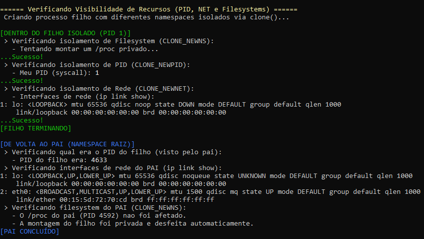
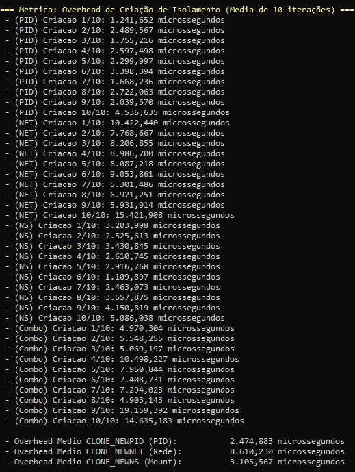
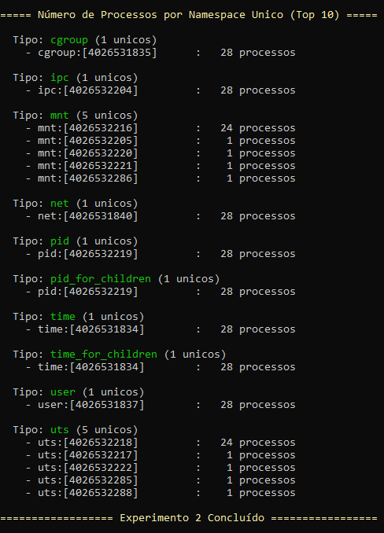

# grupo7_RA3

## Autores do projeto:
### Caliel Carvalho de Medeiros
### Felipe Coelho Ramos
### Leonardo Soares de Mattos

---

## Descrição do Projeto

Este projeto implementa um sistema completo de profiling e análise de recursos para o ambiente Linux, capaz de monitorar, registrar e validar métricas de:

- CPU (por núcleo e global)
- Memória física (RSS) e memória virtual (VMS)
- I/O (leituras e escritas reais e lógicas)
- Overhead causado pelo próprio monitoramento

Além disso, o sistema inclui uma série de experimentos práticos envolvendo primitivas fundamentais do kernel Linux, explorando diretamente:

- Namespaces (PID, NET, MNT)
- Cgroups v2 (CPU, memória e IO)
- Filesystem /proc
- Chamadas clone(), fork(), unshare(), mount()

Este projeto também busca quantificar o custo (overhead) associado ao monitoramento e à criação de ambientes isolados. E o objetivo principal é demonstrar, de forma prática e mensurável, como o kernel Linux provê isolamento, limitação de recursos e containerização — mecanismos que são a base de tecnologias como Docker, LXC, Kubernetes e containers de modo geral.

### Autores do projeto:
* Caliel Carvalho de Medeiros
* Felipe Coelho Ramos
* Leonardo Soares de Mattos

## Guia de Instalação e Compilação (WSL/Ubuntu)
Este guia rápido configura o ambiente de desenvolvimento Linux (WSL) no Windows, instala os compiladores C++ (g++/make) e compila o projeto resource-monitor.

#### Requisitos e dependência para rodar o projeto de maneira efetiva:

##### Instalação do Ambiente WSL

1. Abra o PowerShell ou Prompt de Comando como Administrador.

2. Execute o comando para instalar o WSL e a distribuição Ubuntu padrão:
`wsl --install`

3. Reinicie o computador quando solicitado.

Após reiniciar, o terminal do Ubuntu será aberto. Siga as instruções para criar seu nome de usuário e senha do Linux.

##### Instalação dos Compiladores

1. No seu terminal Ubuntu, atualize a lista de pacotes:
`sudo apt update`

2. Instale os pacotes essenciais de compilação (g++, make, etc.) e o git, tudo com um único comando: `sudo apt install build-essential git -y`

##### Compilação do Projeto

1. Clone o repositório do projeto para dentro do seu ambiente Ubuntu: `git clone https://github.com/Leleomat/grupo7_RA3.git`

2. Navegue até o diretório do projeto (onde o Makefile está): `cd grupo7_RA3/resource-monitor`

3. Limpe a build e compile o código-fonte: `sudo make rebuild` ou faça separado: `sudo make clean` e depois `sudo make all`

5. Execute o programa compilado: `sudo make run`

1. 
##### Execução do projeto

- Ao rodar o programa, o usuário é apresentado ao menu principal, que contém as opções:
>1. Gerenciar Cgroups
>2. Analisar Namespaces
>3. Perfilador de Recursos
>4. Executar Experimentos

>0. Sair

- A opção 1 gerencia os CGroups
- A opção 2 abre um sub-menu com opções relacionadas aos namespaces:
>1. Listar namespaces de um processo
>2. Comparar namespaces entre dois processos
>3. Procurar processos em um namespace especifico
>4. Relatório geral de namespaces

>0. Voltar ao menu inicial

- A opção 3 executa o Perfilador de Recursos
- A opção 4 abre um sub-menu com opções relacionadas aos experimentos:
> CGROUP 

>1. Experimento nº3 – Throttling de CPU
>2. Experimento nº4 – Limite de Memória

> NAMESPACE 

>3. Experimento nº2 - Isolamento via Namespaces

> PROFILER 

>4. Experimento nº1 - Overhead de Monitoramento
>5. Experimento nº5 - Limitação de I/O

>0. Voltar ao menu principal.

---

## Componentes do Projeto

### Componente 1 - Resource Profiler
O Resource Profiler é um dos três componentes principais do Resource Monitor, sendo responsável pelo monitoramento detalhado da utilização de recursos pelos processos do sistema. Sua função é coletar métricas em tempo real da CPU, memória, operações de entrada e saída e rede de cada processo monitorado.

No monitoramento da CPU, o profiler obtém o tempo gasto pelo processo em modo usuário e modo kernel, calculando o percentual de utilização tanto por núcleo quanto do processo total, permitindo identificar cargas elevadas e picos de uso. No monitoramento de memória, ele captura informações como memória residente e memória virtual, possibilitando acompanhar o consumo ao longo da execução e detectar crescimento anômalo ou picos de uso. Para o monitoramento de operações de entrada e saída, número de syscalls de leitura e escrita, o profiler coleta bytes de escrita e leitura e com eles calcula taxas de leitura e escrita total e em disco. Por fim, no monitoramento de rede, ele registra a quantidade de bytes em fila para receber (Rx) e em fila para enviar (Tx), bem como a quantidade de sockets abertos.

O Resource Profiler é implementado de forma modular e periódica, mantendo uma estrutura de dados interna com métricas atuais e históricas de cada processo. Em conjunto com os outros componentes do Resource Monitor, ele fornece uma visão abrangente do comportamento dos processos e da utilização de recursos do sistema, permitindo análise de desempenho, identificação de problemas e suporte a decisões de gerenciamento de recursos.

### Componente 2 - Namespace Analyzer

### Componente 3 - Control Group Manager

---

## Metodologia de Testes
## Responsável - Caliel Carvalho de Medeiros
Para rodar os testes compile o projeto com o makefile e rode cada executável separadamente, através do uso do bash, exemplo: sudo ./teste_cpu.

### Teste de CPU

O teste de CPU verifica a precisão das medições de utilização de processamento. O programa executado realiza operações matemáticas contínuas utilizando um número conhecido de threads, cada uma ocupando aproximadamente um núcleo lógico. O profiler monitora o PID do processo enquanto o htop fornece valores de referência. A validação consiste em comparar o uso esperado com o uso reportado pelo kernel e o uso medido pelo profiler.

### Htop monitorando os cores do cpu

### Resource profiler monitorando CPU% por core e global

Aqui é possível ver que o resource profiler consegue medir de forma precisa o uso da CPU e reportar métricas corretas,
neste caso o uso por core é 775% pois o computador utilizado possui 8 cores, de forma que 96,87% da CPU esteve ocupada com o programa de teste.

### Teste de Memória

O teste de memória valida a medição de alocação de memória RAM. O programa aloca um bloco de tamanho fixo no código e mantém essa alocação ativa até a finalização manual. Durante a execução, o profiler coleta métricas de RSS e memória virtual. As medições de referência são obtidas por /proc/[pid]/status, pmap e ps. A validação compara o valor alocado no código, os valores reportados pelo sistema e os valores capturados pelo profiler, verificando a coerência entre eles.

### Métricas de memória por proc/PID/status

### Métricas de memória pelo resource profiler

Através dessa validação é possível visualizer que o programa consome ~~800Mb de RAM, sendo confirmado pelo acesso direto em proc/PID/status e pelo resource profiler, ambos confirmam que ele utiliza 822.528 kB de RAM física e 1.415.444 kb de memória virtual nesta instância de teste.

### Teste de I/O

O teste de I/O avalia a precisão na medição de bytes escritos e lidos. O programa executa operações contínuas de escrita em arquivo utilizando blocos de tamanho fixo, permitindo calcular exatamente o volume total de dados produzidos. O profiler monitora o PID enquanto os valores reais são obtidos em /proc/[pid]/io. A validação ocorre comparando os valores fornecidos pelo htop e os valores registrados pelo profiler. O programa de teste cria um arquivo .bin em tmp chamado teste_io, nele threads escrevem enquanto uma lê.

### Métricas de I/O pelo profiler

### R/W do htop

Com base na análise das taxas pelo profiler e o htop, a taxa de escrita em disco total ficou constante em por volta de 76 kiB/s, enquanto htop e o profiler não detectaram leitura em disco devido ao cache, o profiler conseguiu capturar uma taxa de leitura lógica de 133.316 Mb/s. O comportamento é esperado pois as threads escrevem 100 bytes cada em ciclos de 5ms, sendo o que o número de threads é num_cores/2. Isso gera uma taxa de escrita constante, já a alta taxa de leitura vem do fato que o tamanho do arquivo aumenta a cada escrita, o que faz com seja o arquivo seja lido várias vezes em um segundo, enquanto cresce proporcionalmente. Os resultados são coerentes.

## Experimentos

### Experimento 1 - Overhead de Monitoramento - Caliel Carvalho de Medeiros

### Condições
O experimento consistiu em medir o overhead introduzido por um sistema de monitoramento de processos em execução no Linux. Um programa de carga de trabalho foi criado para consumir CPU de forma contínua por aproximadamente 5 segundos, realizando operações matemáticas moderadamente pesadas. A medição foi realizada em duas etapas: uma baseline sem monitoramento e execuções monitoradas com diferentes intervalos de amostragem (250 ms, 500 ms e 1000 ms).

### Execução
Durante a fase de baseline, o programa de carga foi executado isoladamente, sem coleta de métricas, para determinar o uso real de CPU e o tempo de execução natural da carga. O resultado obtido indicou um uso médio de CPU de 3.39366% e um tempo de execução de 5.00935 segundos.
Nas execuções monitoradas, o mesmo programa foi executado enquanto o profiler monitorava em intervalos definidos. Com intervalo de 250 ms, o uso médio de CPU monitorado foi de 3.83655%, representando um overhead de 0.44289% em relação à baseline. O tempo total de execução aumentou para 5.2285 segundos, enquanto a latência média da coleta de métricas foi de 0.897269 ms.
Com intervalo de 500 ms, o uso médio de CPU monitorado foi de 3.73543%, gerando um overhead de 0.341777%, com tempo de execução total de 5.05428 segundos e latência média de 0.907534 ms. Para intervalo de 1000 ms, o uso médio de CPU monitorado foi de 3.73837%, resultando em overhead de 0.344713%, tempo de execução de 5.01464 segundos e latência média de 0.839124 ms.

### Resultados
Os resultados indicam que, à medida que o intervalo de amostragem aumenta, a latência média da coleta tende a diminuir, enquanto o overhead de CPU não apresenta variação significativa, mantendo-se em torno de 0.34% a 0.44%. O tempo de execução monitorado permanece próximo ao tempo de baseline, confirmando que a coleta de métricas em intervalos regulares introduz impacto mínimo no desempenho da carga de trabalho, porém ainda introduz de forma que quanto menor a amostragem maior o overhead.

Testes subsequentes demonstraram que os resultados sofrem com ruído de medição.

### Experimento 2 - Isolamento via Namespaces - Leonardo Soares de Mattos

### Condições

Este experimento foi projetado para validar a eficácia do isolamento de recursos fornecido pelos namespaces do kernel Linux e medir o overhead de performance associado à sua criação. O objetivo principal era demonstrar que um processo-filho pode ter uma visão do sistema (PIDs, rede, montagens de filesystem) completamente diferente e isolada do processo-pai.

A execução do experimento exigiu privilégios de superusuário (sudo), pois as chamadas de sistema clone(), unshare() e mount() para criar e gerenciar novos namespaces são operações protegidas.

### Execução

O experimento foi dividido em três partes principais:

1. Medição de Overhead: Foi medido o tempo de criação (em microssegundos) necessário para criar um novo processo e isolá-lo usando fork() e unshare() com diferentes flags. Este teste foi executado 10 vezes para cada tipo de namespace (PID, NET, NS) e para uma combinação de todos eles, a fim de calcular uma média de overhead.

2. Validação de Isolamento: Um processo-filho foi criado usando a chamada clone() com as flags CLONE_NEWPID, CLONE_NEWNET e CLONE_NEWNS.

-  Dentro do Filho: O processo verificou seu próprio PID (esperando ser 1), listou suas interfaces de rede (esperando ver apenas a loopback) e tentou montar um filesystem /proc privado (validando o isolamento de montagem).

- Dentro do Pai: O processo-pai verificou o PID do filho (visto do namespace raiz, ex: 4633), listou suas próprias interfaces de rede (mostrando loopback e a interface eth0 real) e confirmou que seu próprio filesystem /proc não foi afetado.

3. Análise do Sistema: O programa varreu o filesystem /proc para identificar todos os namespaces únicos existentes no sistema e contar quantos processos estavam associados a cada um.

### Resultados

Os resultados confirmaram o sucesso do isolamento e quantificaram o custo de sua criação.

1. Tabela de Isolamento Efetivo: A validação de isolamento foi bem-sucedida, como demonstrado na tabela de efetividade gerada pelo programa:

 Tipo de Namespace  |  Recurso Isolado?  |   Observação 
:-----------------: | :----------------: | :-------------:
PID (CLONE_NEWPID)  |        Sim         | Filho enxerga-se como PID 1 
Rede (CLONE_NEWNET) |        Sim         | Filho enxerga somente a interface 'lo' (loopback)
Mount (CLONE_NEWNS) |        Sim         | Montagens do filho (ex: /proc) nao afetam o pai

2. Overhead de Criação (Média de 10 iterações): As medições de performance mostraram que a criação de namespaces tem um custo, sendo o de rede (NET) o mais significativo:

- Overhead Médio CLONE_NEWPID (PID): 2.474,883 microssegundos
- Overhead Médio CLONE_NEWNET (Rede): 8.610,230 microssegundos
- Overhead Médio CLONE_NEWNS (Mount): 3.105,567 microssegundos
- Overhead Médio Combinação (PID+NET+NS): 8.743,730 microssegundos

3. Número de Processos por Namespace Único: A análise do sistema revelou que, embora a maioria dos processos compartilhasse os namespaces padrão, alguns namespaces (como mnt e uts) já possuíam instâncias isoladas:

- cgroup: 1 namespace único (com 28 processos)
- ipc: 1 namespace único (com 28 processos)
- mnt: 5 namespaces únicos (um com 24 processos, os outros 4 com 1 processo cada)
- net: 1 namespace único (com 28 processos)
- pid: 1 namespace único (com 28 processos)
- user: 1 namespace único (com 28 processos)
- uts: 5 namespaces únicos (um com 24 processos, os outros 4 com 1 processo cada)

O experimento concluiu com sucesso que os namespaces são uma ferramenta eficaz para o isolamento de recursos.

### Experimento 3 - Throttling de CPU - Felipe Coelho Ramos

### Condições

### Execução

### Resultado

### Experimento 4 - Limitação de Memória - Felipe Coelho Ramos

### Condições

### Execução

### Resultado

### Experimento 5 - Limitação de I/O - Caliel Carvalho de Medeiros

### Condições
Foram definidas as seguintes condições experimentais:

- **Sistema operacional**: Linux (WSL2 ou kernel nativo);
- **Processo de teste**: I/O-intensive, realizando leituras e escritas contínuas em disco;
- **Limite de I/O configurado**: 1.000.000 B/s (bytes por segundo);
- **Métricas coletadas**:
  - Throughput real (B/s);
  - Latência média de operação de I/O (ms/op);
  - Tempo total de execução (s);
  - Comparação do tempo total com o valor esperado pelo limite configurado.

O objetivo era verificar a precisão da limitação de I/O e avaliar o impacto no desempenho do processo.

### Execução
+. **Baseline sem limitação:**  
   O processo de teste foi executado sem aplicação de limite, permitindo medir o throughput máximo e a latência natural das operações de I/O.

+. **Execução com limitação:**  
   Durante a execução, aplicamos limites de I/O diretamente no código, controlando a taxa de leitura e escrita para impor restrições de throughput. Durante a execução:
   - O total de bytes lidos e escritos foi registrado;
   - O número de operações de I/O realizadas foi contado;
   - A latência média de cada operação foi calculada como `tempo total / número de operações`;
   - O throughput real foi calculado como `total de bytes / tempo total`;
   - O tempo total de execução foi comparado ao valor esperado baseado no limite configurado.

+. **Coleta de métricas detalhada:**  
   - `bytesLidos` e `bytesEscritos`: total de bytes processados;
   - `rchar` e `wchar`: contadores de leituras e escritas de caracteres;
   - Latência média de operação em milissegundos;
   - Comparação percentual do tempo total de execução com o previsto.

### Resultados
| Métrica                        | Valor        |
|--------------------------------|-------------|
| Limite configurado (B/s)       | 1.000.000   |
| Throughput medido (B/s)        | 998.911     |
| Latência média de I/O (ms/op)  | 0,00256494  |
| Tempo total de execução (s)    | 10,4972     |
| Tempo esperado se limitado (s) | 10,4858     |
| Impacto no tempo total (%)     | 0,109       |

**Análise Técnica:**  
- O throughput real medido (998.911 B/s) está muito próximo do limite configurado, indicando que o mecanismo de throttling é preciso.  
- A latência média por operação de I/O é extremamente baixa (aproximadamente 2,5 µs), mostrando que o overhead do throttle é praticamente desprezível.  
- O impacto no tempo total de execução do processo é de apenas 0,109%, confirmando que a limitação de I/O é eficaz sem degradar significativamente a performance.  
- Pequenas variações observadas nos resultados podem ser explicadas por ruído do sistema, concorrência de processos e variabilidade inerente ao scheduler do Linux.

---

Funcionalidades Extras (Bônus) implementadas: 
- Código Excepcionalmente bem comentado (+10)
- Suporte a cgroup v2 (unified hierarchy) (+5)

Observações:
- A compilação ocorreu sem warnings (`-Wall -Wextra`).
- O usuário Leleomat (Leonardo) é o dono do repositório e quem gerenciou os Pull Requests, por isso ele tem alguns commits realizados diretamente na Main, sejam commits iniciais gerais, ou de ajuste na Main de arquivos/pastas que foram enviados para ela e não deveriam ter sido, mantendo a integridade do projeto.
- Os contribuidores são somente os três integrantes citados no início deste README, se por ventura aparecer algum contribuidor chamado "root", somos nós, pois isso ocorreu ao utilizar comandos sudo com o git, o que ocasionou o surgimento do "root". 
- Sobre a estrutura do projeto, temos os arquivos .py e .sh, porém como não foram necessárias suas utilizações, os arquivos existem e estão no projeto, porém vazios.
- Este projeto foi desenvolvido para a disciplina de Sistemas de Computação (PUCPR).
